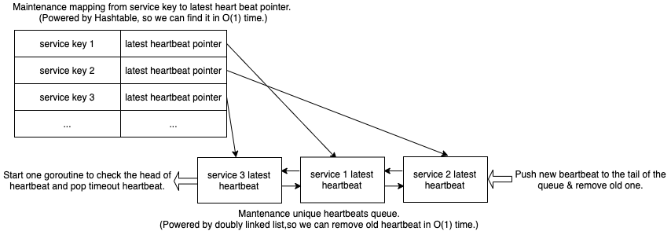

# heartfelt

[](https://opensource.org/licenses/MIT)
[](https://github.com/bunnier/heartfelt/actions/workflows/go.yml)
[](https://goreportcard.com/report/github.com/bunnier/heartfelt)
[](https://pkg.go.dev/github.com/bunnier/heartfelt)

A high performance heartbeat watcher.

## Algorithm



## Usage

Core [Apis](https://pkg.go.dev/github.com/bunnier/heartfelt)

```go
type HeartHub
func NewHeartHub(options ...heartHubOption) *HeartHub

func (hub *HeartHub) Heartbeat(key string, disposable bool) error
func (hub *HeartHub) GetEventChannel() <-chan *Event
func (hub *HeartHub) Remove(key string) error
func (hub *HeartHub) Close()
```

Example

```go
package main

import (
	"context"
	"log"
	"strconv"
	"time"

	"github.com/bunnier/heartfelt"
)

func main() {
	// HeartHub is the api entrance of this package.
	heartHub := heartfelt.NewHeartHub(
		heartfelt.WithDegreeOfParallelismOption(2),
		heartfelt.WithTimeoutOption(time.Second),
	)
	eventCh := heartHub.GetEventChannel() // Events will be sent to this channel later.

	ctx, cancel := context.WithTimeout(context.Background(), time.Second*15) // For exit this example.
	defer cancel()

	// startFakeServices will start 10000 fake services, each service make heartbeat in 200ms regularly.
	// But these services: index in {67, 120, 100, 3456, 4000, 5221, 7899, 9999} will stop work after {its_id} ms.
	// Fortunately, heartHub will catch them all ^_^
	go startFakeServices(ctx, heartHub, 10000, []int{67, 120, 100, 3456, 4000, 5221, 7899, 9999})

	for {
		select {
		case event := <-eventCh:
			// The special service checking will be stop after timeout or heartHub.Remove(key) be called manually.
			log.Default().Printf("received an event: heartKey=%s eventName=%s, lastBeatTime=%d, eventTime=%d, foundTime=%d",
				event.HeartKey, event.EventName, event.BeatTime.UnixMilli(), event.EventTime.UnixMilli(), event.EventTime.UnixMilli()-event.BeatTime.UnixMilli())
		case <-ctx.Done():
			heartHub.Close()
			return
		}
	}
}

// startFakeServices will start fake services.
func startFakeServices(ctx context.Context, heartHub *heartfelt.HeartHub, serviceNum int, stuckIds []int) {
	// These ids will stuck later.
	stuckIdsMap := make(map[int]struct{})
	for _, v := range stuckIds {
		stuckIdsMap[v] = struct{}{}
	}

	for i := 1; i <= serviceNum; i++ {
		ctx := ctx
		if _, ok := stuckIdsMap[i]; ok {
			ctx, _ = context.WithTimeout(ctx, time.Duration(i)*time.Millisecond)
		}

		// Each goroutine below represents a service.
		key := strconv.Itoa(i)
		go func() {
			for {
				select {
				case <-ctx.Done():
					return
				default:
					// Send heartbeat..
					// Second parameter means auto removing the key from heartHub
					// after timeout, otherwise it will be watched again.
					heartHub.Heartbeat(key, true)
					time.Sleep(500 * time.Millisecond)
				}
			}
		}()
	}
}
```

Output

```bash
2022/03/08 21:38:32 received an event: heartKey=67 eventName=TIME_OUT, lastBeatTime=1646746711297, eventTime=1646746712297, foundTime=1000
2022/03/08 21:38:32 received an event: heartKey=100 eventName=TIME_OUT, lastBeatTime=1646746711297, eventTime=1646746712297, foundTime=1000
2022/03/08 21:38:32 received an event: heartKey=120 eventName=TIME_OUT, lastBeatTime=1646746711297, eventTime=1646746712297, foundTime=1000
2022/03/08 21:38:35 received an event: heartKey=3456 eventName=TIME_OUT, lastBeatTime=1646746714305, eventTime=1646746715305, foundTime=1000
2022/03/08 21:38:35 received an event: heartKey=4000 eventName=TIME_OUT, lastBeatTime=1646746714807, eventTime=1646746715807, foundTime=1000
2022/03/08 21:38:37 received an event: heartKey=5221 eventName=TIME_OUT, lastBeatTime=1646746716310, eventTime=1646746717310, foundTime=1000
2022/03/08 21:38:39 received an event: heartKey=7899 eventName=TIME_OUT, lastBeatTime=1646746718818, eventTime=1646746719818, foundTime=1000
2022/03/08 21:38:41 received an event: heartKey=9999 eventName=TIME_OUT, lastBeatTime=1646746720821, eventTime=1646746721821, foundTime=1000
```
