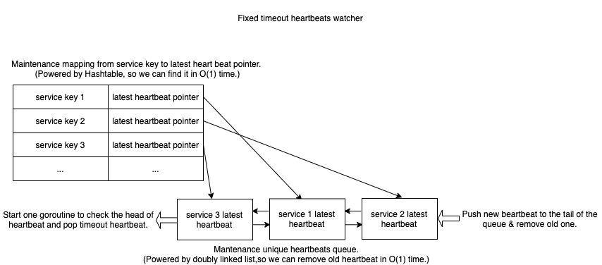

# heartfelt

[](https://opensource.org/licenses/MIT)
[](https://github.com/bunnier/heartfelt/actions/workflows/go.yml)
[](https://goreportcard.com/report/github.com/bunnier/heartfelt)
[](https://pkg.go.dev/github.com/bunnier/heartfelt)

A high performance heartbeat watcher.

## Algorithm

### 1. Fixed timeout watcher



## Usage

### Example 1: Fixed timeout watcher

```go
package main

import (
	"context"
	"log"
	"strconv"
	"time"

	"github.com/bunnier/heartfelt"
)

func main() {
	// FixedTimeoutHeartHub is a heartbeat watcher of fixed timeout service.
	heartHub := heartfelt.NewFixedTimeoutHeartHub(
		time.Second, // Timeout duration is 1s.
		heartfelt.WithDegreeOfParallelismOption(2),
	)
	eventCh := heartHub.GetEventChannel() // Events will be sent to this channel later.

	ctx, cancel := context.WithTimeout(context.Background(), time.Second*15) // For exit this example.
	defer cancel()

	// startFakeServices will start 10000 fake services, each service make heartbeat in 500ms regularly.
	// But these services: index in {67, 120, 100, 3456, 4000, 5221, 7899, 9999} will stop work after {its_id} ms.
	// Fortunately, heartHub will catch them all ^_^
	go startFakeServices(ctx, heartHub, 10000, []int{67, 120, 100, 3456, 4000, 5221, 7899, 9999})

	for {
		select {
		case event := <-eventCh:
			// The special service checking will be stop after timeout or heartHub.Remove(key) be called manually.
			log.Default().Printf("received an event: heartKey=%s eventName=%s, timeout duration=%d, timeoutTime=%d, eventTime=%d, offset=%dms",
				event.HeartKey, event.EventName, event.Timeout/time.Millisecond, event.TimeoutTime.UnixMilli(), event.EventTime.UnixMilli(), event.EventTime.Sub(event.TimeoutTime)/time.Millisecond)
		case <-ctx.Done():
			heartHub.Close()
			return
		}
	}
}

// startFakeServices will start fake services.
// Each service will make heartbeat in 500ms regularly.
func startFakeServices(ctx context.Context, heartHub heartfelt.HeartHub, serviceNum int, stuckIds []int) {
	// These ids will stuck later.
	stuckIdsMap := make(map[int]struct{})
	for _, v := range stuckIds {
		stuckIdsMap[v] = struct{}{}
	}

	for i := 1; i <= serviceNum; i++ {
		ctx := ctx
		if _, ok := stuckIdsMap[i]; ok {
			ctx, _ = context.WithTimeout(ctx, time.Duration(i)*time.Millisecond)
		}

		// Each goroutine below represents a service.
		key := strconv.Itoa(i)
		go func() {
			for {
				select {
				case <-ctx.Done():
					return
				default:
					// Send heartbeat..
					heartHub.DisposableHeartbeat(key)
					time.Sleep(500 * time.Millisecond)
				}
			}
		}()
	}
}
```

Output

```bash
2022/03/13 14:35:19 received an event: heartKey=67 eventName=TIME_OUT, timeout duration=1000, timeoutTime=1647153319675, eventTime=1647153319675, offset=0ms
2022/03/13 14:35:19 received an event: heartKey=100 eventName=TIME_OUT, timeout duration=1000, timeoutTime=1647153319675, eventTime=1647153319675, offset=0ms
2022/03/13 14:35:19 received an event: heartKey=120 eventName=TIME_OUT, timeout duration=1000, timeoutTime=1647153319675, eventTime=1647153319675, offset=0ms
2022/03/13 14:35:22 received an event: heartKey=3456 eventName=TIME_OUT, timeout duration=1000, timeoutTime=1647153322684, eventTime=1647153322684, offset=0ms
2022/03/13 14:35:23 received an event: heartKey=4000 eventName=TIME_OUT, timeout duration=1000, timeoutTime=1647153323184, eventTime=1647153323184, offset=0ms
2022/03/13 14:35:24 received an event: heartKey=5221 eventName=TIME_OUT, timeout duration=1000, timeoutTime=1647153324686, eventTime=1647153324687, offset=0ms
2022/03/13 14:35:27 received an event: heartKey=7899 eventName=TIME_OUT, timeout duration=1000, timeoutTime=1647153327196, eventTime=1647153327196, offset=0ms
2022/03/13 14:35:29 received an event: heartKey=9999 eventName=TIME_OUT, timeout duration=1000, timeoutTime=1647153329198, eventTime=1647153329198, offset=0ms
```

### Example 2: Dynamic timeout watcher

```go
package main

import (
	"context"
	"log"
	"math/rand"
	"reflect"
	"sort"
	"strconv"
	"time"

	"github.com/bunnier/heartfelt"
)

func main() {
	// DynamicTimeoutHearthub is a heartbeat watcher of dynamic timeout service.
	heartHub := heartfelt.NewDynamicTimeoutHearthub(
		heartfelt.WithDegreeOfParallelismOption(1),
	)
	eventCh := heartHub.GetEventChannel() // Events will be sent to this channel later.

	ctx, cancel := context.WithTimeout(context.Background(), time.Second*1)
	defer cancel()

	serviceNum := 20 // The number of fake services.

	// Make random timeout list.
	rand := rand.New(rand.NewSource(time.Now().Unix()))
	var timeoutList []int
	for i := 0; i < serviceNum; i++ {
		timeout := rand.Int()%400 + 100
		timeoutList = append(timeoutList, timeout)
	}

	// Start fake services.
	go func() {
		for index, timeout := range timeoutList {
			key := strconv.Itoa(index)
			timeout := timeout
			go func() {
				heartHub.DisposableHeartbeatWithTimeout(key, time.Duration(timeout)*time.Millisecond)
			}()
		}
	}()

	receivedTimeoutList := make([]int, 0, len(timeoutList))
OVER:
	for {
		select {
		case event := <-eventCh:
			log.Default().Printf("received an event: eventName=%s, timeout duration=%d, timeoutTime=%d, eventTime=%d, offset=%dms",
				event.EventName, event.Timeout/time.Millisecond, event.TimeoutTime.UnixMilli(), event.EventTime.UnixMilli(), event.EventTime.Sub(event.TimeoutTime)/time.Millisecond)
			receivedTimeoutList = append(receivedTimeoutList, int(event.Timeout/time.Millisecond)) // Record receive timeout order.
		case <-ctx.Done():
			heartHub.Close()
			break OVER
		}
	}

	sort.IntSlice(timeoutList).Sort() // Received order must equal with sort result.
	if reflect.DeepEqual(timeoutList, receivedTimeoutList) {
		log.Default().Println("Exactly equal!")
	}
}
```

Output

```bash
2022/03/13 14:32:31 received an event: eventName=TIME_OUT, timeout duration=122, timeoutTime=1647153151748, eventTime=1647153151748, offset=0ms
2022/03/13 14:32:31 received an event: eventName=TIME_OUT, timeout duration=148, timeoutTime=1647153151774, eventTime=1647153151775, offset=0ms
2022/03/13 14:32:31 received an event: eventName=TIME_OUT, timeout duration=198, timeoutTime=1647153151824, eventTime=1647153151825, offset=0ms
2022/03/13 14:32:31 received an event: eventName=TIME_OUT, timeout duration=219, timeoutTime=1647153151845, eventTime=1647153151845, offset=0ms
2022/03/13 14:32:31 received an event: eventName=TIME_OUT, timeout duration=226, timeoutTime=1647153151852, eventTime=1647153151852, offset=0ms
2022/03/13 14:32:31 received an event: eventName=TIME_OUT, timeout duration=247, timeoutTime=1647153151873, eventTime=1647153151873, offset=0ms
2022/03/13 14:32:31 received an event: eventName=TIME_OUT, timeout duration=253, timeoutTime=1647153151879, eventTime=1647153151879, offset=0ms
2022/03/13 14:32:31 received an event: eventName=TIME_OUT, timeout duration=261, timeoutTime=1647153151887, eventTime=1647153151888, offset=1ms
2022/03/13 14:32:31 received an event: eventName=TIME_OUT, timeout duration=270, timeoutTime=1647153151896, eventTime=1647153151896, offset=0ms
2022/03/13 14:32:31 received an event: eventName=TIME_OUT, timeout duration=288, timeoutTime=1647153151914, eventTime=1647153151914, offset=0ms
2022/03/13 14:32:31 received an event: eventName=TIME_OUT, timeout duration=290, timeoutTime=1647153151916, eventTime=1647153151916, offset=0ms
2022/03/13 14:32:31 received an event: eventName=TIME_OUT, timeout duration=293, timeoutTime=1647153151919, eventTime=1647153151919, offset=0ms
2022/03/13 14:32:31 received an event: eventName=TIME_OUT, timeout duration=297, timeoutTime=1647153151923, eventTime=1647153151923, offset=0ms
2022/03/13 14:32:31 received an event: eventName=TIME_OUT, timeout duration=299, timeoutTime=1647153151925, eventTime=1647153151925, offset=0ms
2022/03/13 14:32:31 received an event: eventName=TIME_OUT, timeout duration=359, timeoutTime=1647153151985, eventTime=1647153151985, offset=0ms
2022/03/13 14:32:31 received an event: eventName=TIME_OUT, timeout duration=369, timeoutTime=1647153151995, eventTime=1647153151995, offset=0ms
2022/03/13 14:32:32 received an event: eventName=TIME_OUT, timeout duration=417, timeoutTime=1647153152043, eventTime=1647153152043, offset=0ms
2022/03/13 14:32:32 received an event: eventName=TIME_OUT, timeout duration=443, timeoutTime=1647153152069, eventTime=1647153152070, offset=1ms
2022/03/13 14:32:32 received an event: eventName=TIME_OUT, timeout duration=444, timeoutTime=1647153152070, eventTime=1647153152070, offset=0ms
2022/03/13 14:32:32 received an event: eventName=TIME_OUT, timeout duration=472, timeoutTime=1647153152098, eventTime=1647153152098, offset=0ms
2022/03/13 14:32:32 Exactly equal!
```
